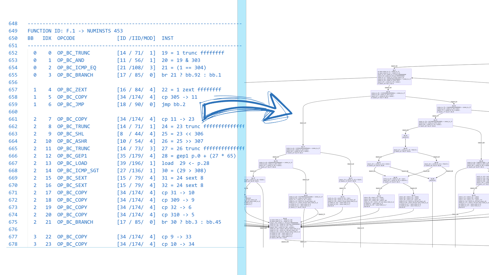

# ClamAV IR Visualizer

IR generated with `clambc --printbcir print_flag.cbc > ir.log`



# Usage

```
python main.py ir.log
```

Then the func#.html will generate at the root of this project

# Thanks to

- Python mermaid module -  [QuattroMusic/PyMermaid (github.com)](https://github.com/QuattroMusic/PyMermaid)
- Svg pan and zoom - [anvaka/panzoom(github.com)](https://github.com/anvaka/panzoom)
- mermaid-js - [mermaid-js/mermaid (github.com)](https://github.com/mermaid-js/mermaid)
